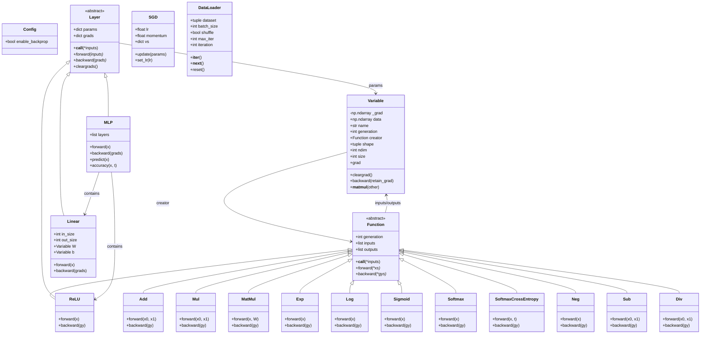

# DPTiny

A minimal implementation of a deep learning framework for educational purposes.

## Features

- Automatic differentiation (autograd) system
- Basic mathematical operations with operator overloading
- NumPy-based computation

## Installation

```bash
pip install -e .
```

## Usage Example

```python
import numpy as np
from dptiny import Variable

# Create variables
x = Variable(np.array(2.0))
y = Variable(np.array(3.0))

# Perform operations
z = x * y
print(z.data)  # 6.0

# Compute gradients
z.backward()
print(x.grad)  # 3.0
print(y.grad)  # 2.0
```

## Architecture



## Requirements

- NumPy
